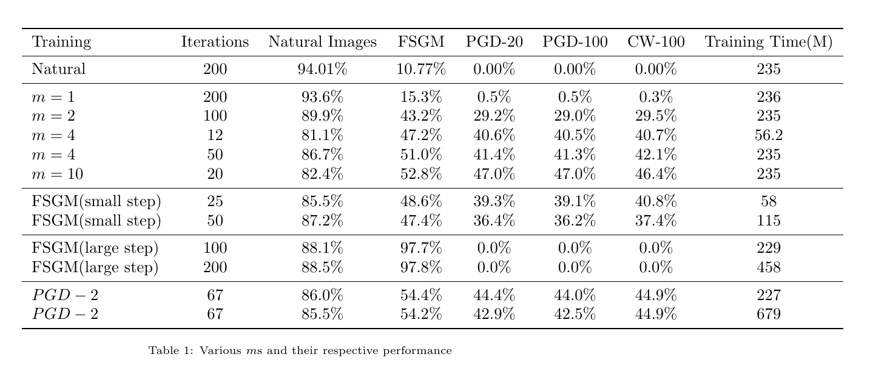
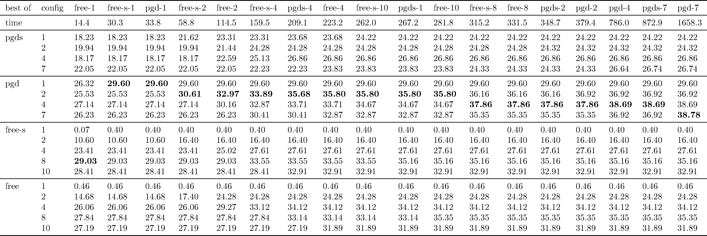
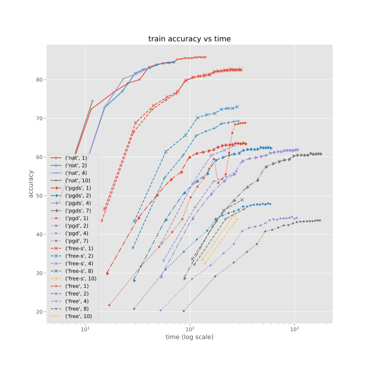
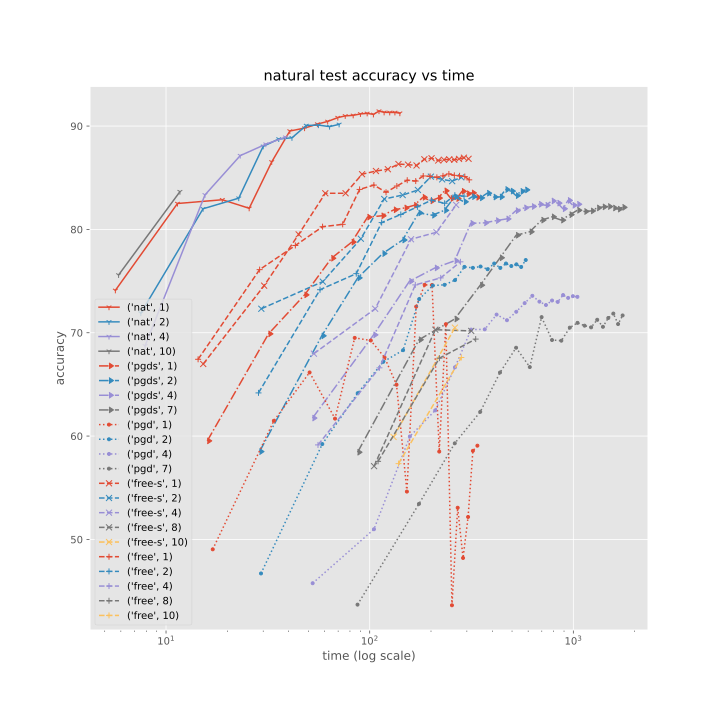
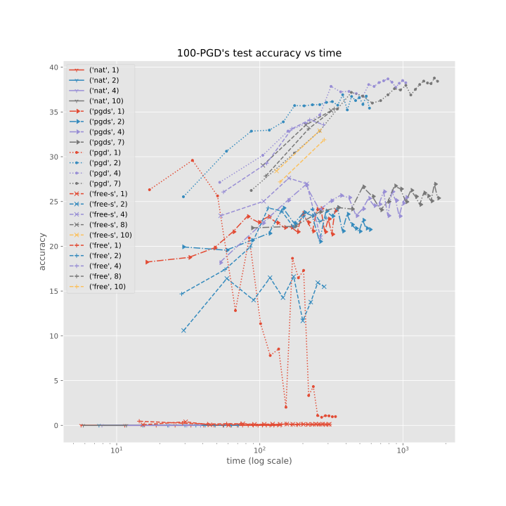

# Implementation of [Adversarial Training for Free!](https://arxiv.org/abs/1904.12843)

This is a reimplementation from scratch of the paper "Adversarial Training for Free!" in the context of the course [IFT 6756 - Game Theory and ML course](https://gauthiergidel.github.io/courses/game_theory_ML_2021.html).

The implementation is in the src folder; the notebooks test the paper slightly.

The notebooks contain a few tests. 

The `cifar` notebook is a test on CIFAR-10 with a wide resnet where we test paper. It compares training with replay, adversarial training, and training for free. 

The fashion mnist test case is in the `small_batch` branch. Due to some parallel work, it uses an older version of the code hence why it's in a branch. The goal was to train a model for "free" with small batches since the authors use large batches. 

Last but not least, the `audio` notebook is an example of audio classification based [on the one from the pytorch tutorials](https://pytorch.org/tutorials/intermediate/speech_command_classification_with_torchaudio_tutorial.html) with a network that resembles the [M5](https://arxiv.org/abs/1610.00087) network with two of the convolution layers replaced with resnet blocks. I used this last notebook to do more in-depth testing because testing with CIFAR is time-consuming.

The PyTorch layer `AdversarialForFree` can be added to any model with `nn.Sequential` to get adversarial training for free. Honestly, this just felt like a wasted opportunity by the authors. Just remember to call `.step()` after each gradient calculation; I've wasted too many hours wondering why no training is getting done. 

## Pain points

I ran into a few problems coding this up. For instance, I read the neurips version, which does not have the pseudocode. Wide Reset 32 layers, 10 times wider, does not seem to exist. According to the default implementation, it should have $(d - 4) \% = 0$ layers. The Carlini-Wagner loss is not really the Carlini-Wagner loss as their implementation was a bit more complicated (for better or worse, they don't use PGD to solve the problem). Here we used the same algorithm as the one in the main repo. Clamping the adversarial example in the valid domain is not mentioned in the pseudocode but is present in the implementation, so we kept it. We weren't sure what PGD with restarts was, so we ignored it. The learning rate for PGD $2.5\epsilon/K$ was a bit tricky to find.

## Remarks 

This layer makes the training a bit harder. In fact, I claim that it makes training more complicated than regular adversarial training. Surprisingly, even though training with replay reduces the CPU-GPU data transfer, it doesn't make it faster. I guess this is due to PyTorch's (and Cuda's?) async nature. The biggest downside of this method is the lack of control over how good the model should be against adversarial examples and the cost of training with replays.

The results on the cifar 10 dataset can be seen below. FSGM (large step) uses a $2\epsilon$ step size while the counterpart uses a $0.9\epsilon$. Most of this table can be generated with the `cifar` notebook. All of the times are for a gtx-3090. This was done with 200 iterations (at most) with decays at 60, 120 and 180 iterations (devided by $m$ for free and $K + 1$ for PGD-K) with a dropout rate of 0.3 and a random crops. The $\espilon$ was set to 8. 

As it can be seen, it's not clear in this example whether training for free is worth using or not. The most interesting case is those two examples that take less than an hour to train. It's possible to reach interesting performance levels with both training methods in a short amount of time. But even in the best case for the training for free model (m=10), the performance and time are pretty close to the time needed to train the PGD-2 model. To me, it's unclear which is better, especially for short training times. If time is not a problem, the obvious choice is PGD.

Since testing on the cifar set took around 40 minutes, i didn't test it a lot but on the audio example it was cheap enough to test alot. $\epsilon$ was set to 0.01 which would just turn a clear sound into a sound captured with a bad microphone next to laptop with fans running at full speed. While more adaptive schemes might have been better since adding noise on the places where to users speak is less detectable than the total silence, i didn't do it. The table below might seem a bit confusing but the idea was to take the best value of each model using the validation adversarial loss and then put the best adversarial loss(again using the validation set) until that given time(or the next epoch if it was closer). So for instnace the column with `free-1` on the top means that the at 14.4s the model `free-1` reached it's best performance and on the values before the best performace of the other models in that period is written. All of the numbers are either second or percentage. The config column represents the K in PGD-K or m in case of free training. As it can be seen PGD-K is the definite winner except for the first case confirming the results of [Fast is better than free](https://arxiv.org/abs/2001.03994). The figures below plot the loss progression attention the the logarithmic scale of time. In case the audios don't play, they can be found in the `audio` folder. The varians with `s` at the end use either half the step size in the case of free or one fifth of the step size in the case of PGD. The attack was only PGD-100 with early stopping(when all predictions are wrong).

